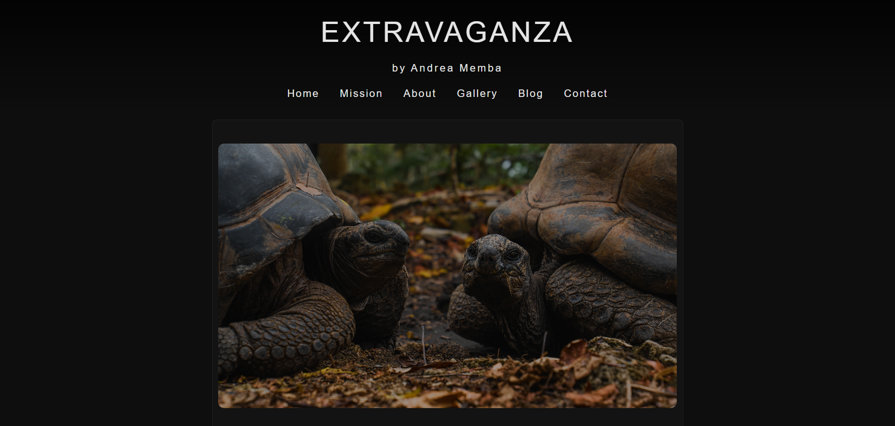

# Extravaganza - Andrea Memba



**Extravaganza** is the portfolio website of **Andrea Memba**, a photographer and filmmaker passionate about reshaping the African narrative through cinematic visual storytelling.

---

## 🌍 Overview

This website showcases Andrea’s mission, portfolio, blog, and contact information. It highlights her work in photography and videography with a cinematic and artistic design approach.

**Built with:** HTML5 & CSS3 | **No libraries or frameworks used**

---

## 📂 Pages

* **Home** – Hero section, introduction, cinematic overview.
* **Mission** – Mission statement, alignment with Global Challenges & Opportunities, planned impact.
* **About** – Personal bio, skills, and cinematic “Who is Andrea?” section.
* **Gallery** – Portfolio of photography and visual storytelling.
* **Blog** – Posts about projects, experiences, and insights.
* **Contact** – Contact form and social media links.

---

## ⚡ Features

* Fully **responsive design** for desktop, tablet, and mobile.
* Cinematic layout with large images and artistic typography.
* Easy **navigation** across pages.
* Clean, minimalistic **HTML & CSS-only code**.

---

## 🛠 Setup

1. Clone the repository:

   ```bash
   git clone https://github.com/yourusername/extravaganza.git
   ```
2. Maintain the folder structure:

   ```
   /assets/img/  → images
   /css/style.css → CSS file
   *.html → website pages
   ```
3. Open any `.html` file in a web browser.

---

## 📣 Credits

* All content created by Andrea Memba unless otherwise specified.
* External resources are copyright-free or properly credited.
* AI used only for reference and guidance.

---

## 🚀 Future Improvements

* Add CSS-based animations and cinematic transitions.
* Expand blog with multiple posts.
* Optimize images for performance.
* Add a pure CSS lightbox for the gallery.

---

## 📬 Contact

**Andrea Memba** – Photographer & Filmmaker
Email: a.memba@alustudent.com
Instagram / LinkedIn: @with_ubuntu
